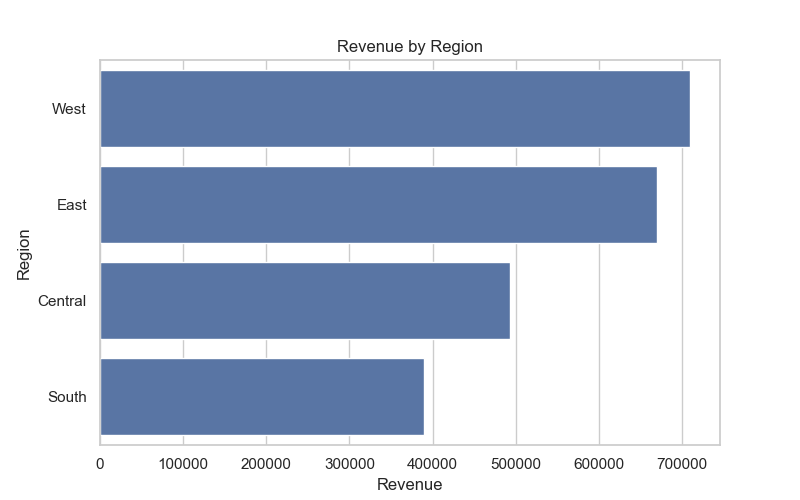
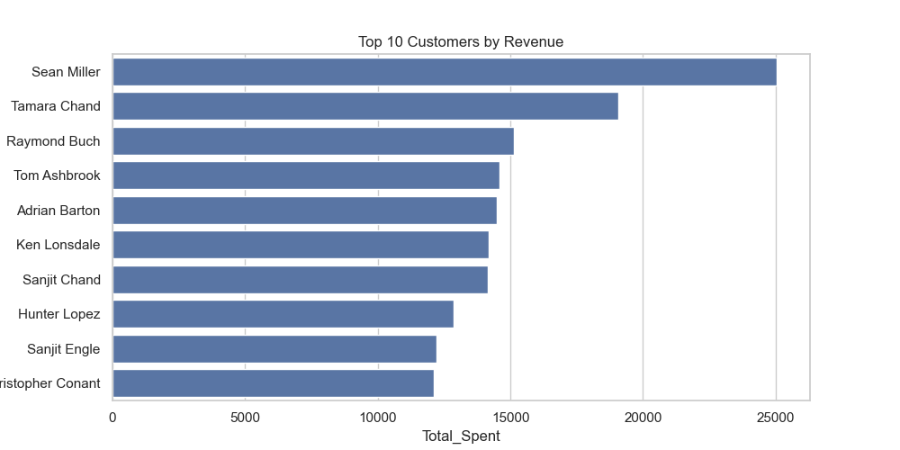
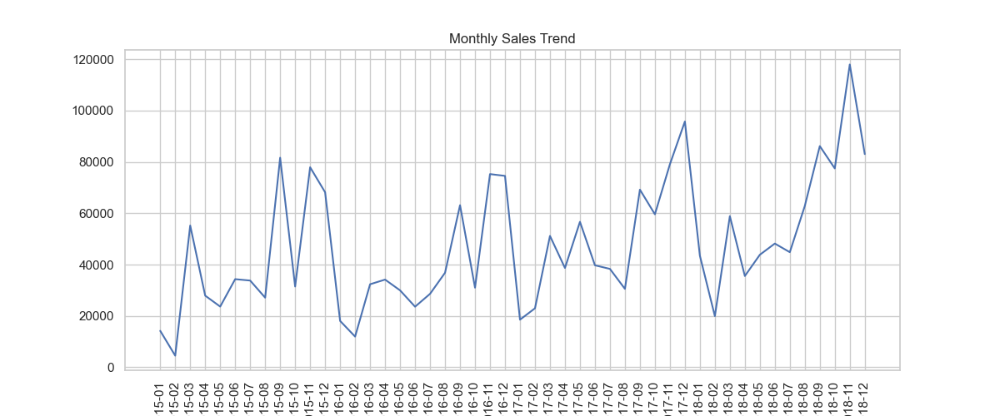

# 📊 Sales Data Analysis & Business Insights (SQL + Python)

## 📌 Project Overview

This project analyzes retail sales data using SQL and Python to uncover revenue trends, customer behavior, and regional performance insights.

The analysis focuses on:

* Total revenue generation
* Regional sales performance
* Top revenue-generating customers
* Monthly sales trends
* Business-driven recommendations

---

## 🛠 Tech Stack

* Python
* Pandas
* SQLite
* SQL (GROUP BY, ORDER BY, Aggregations)
* Matplotlib
* Seaborn
* Jupyter Notebook

---

## 📂 Dataset

The dataset includes:

* Order ID
* Order Date
* Customer Name
* Region
* Category
* Sales
* Profit
* Quantity

---

# 📊 Key Insights

---

## 1️⃣ Revenue by Region



* West region generates the highest revenue.
* East region follows closely.
* South region contributes the least to total revenue.
* Revenue distribution shows strong geographic concentration.

---

## 2️⃣ Top 10 Customers



* A small number of customers contribute significantly to overall sales.
* High-value customers represent a major revenue segment.
* Indicates opportunity for loyalty and retention programs.

---

## 3️⃣ Monthly Sales Trend



* Sales show steady growth over time.
* Certain months demonstrate seasonal spikes.
* Revenue patterns suggest predictable demand cycles.

---

# 💡 Business Recommendations

* Focus marketing investments in high-performing regions.
* Develop loyalty programs for top customers.
* Analyze underperforming regions for growth opportunities.
* Use seasonal sales patterns for inventory planning and forecasting.

---

## 🚀 How to Run

1. Clone the repository:

```
git clone https://github.com/aniket252005/sales-sql-analysis.git
```

2. Navigate to project folder:

```
cd sales-sql-analysis
```

3. Install dependencies:

```
pip install pandas matplotlib seaborn
```

4. Open notebook:

```
jupyter notebook
```

---

## 👤 Author

**Aniket Pandey**
Aspiring Data Scientist
Python | SQL | Data Analysis | Machine Learning

